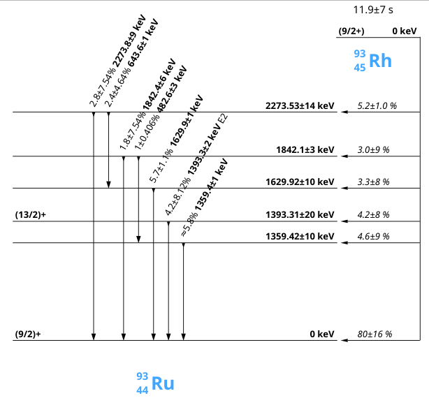

# Nuclei
[](https://circleci.com/gh/martukas/nuclei/tree/master)

An Evaluated Nuclear Structure Data
([ENSDF](https://www.nndc.bnl.gov/ensdf/)) 
parser, viewer and editor.

A future library for native ENSDF access and manipulation in C++.



## Goals
* Complete and authentic parsing of ENSDF files. Many projects out there neglect some data
deemed irrelevant to their application, i.e. uncertainties in half-life. The aim is to parse
all ENSDF information in full.
* Integrability with other analysis and simulation tools. Once the ENSDF data is imported,
it is stored in a hierarchical object-oriented way, for easy access in a native
C++-idiomatic way.
* The graphical interface should display the information intuitively but comprehensively.
Relevant LaTeX is rendered in the notes. Literature references link to web resources.
* Editing should be possible to allow supplementing of nuclear data based on experimental work.

Many of these goals have been partially met, but the project is in need of additional stewardship.

## Building

This software should build on Linux and macOS.

Prerequisites:
* C++ compiler
* CMake
* Qt5 (from your native package manager)
* Conan (most likely via pip)

Add these conan repositories if needed:
```bash
conan remote add conancenter https://center.conan.io
conan remote add ess-dmsc https://artifactory.esss.lu.se/artifactory/api/conan/ecdc-conan-release
```

The ESS remote is required for QtColorWidgets. In case of changes to their deployment infrastructure, check for updates [here](https://github.com/ess-dmsc/conan-configuration).

Clone code and build:
```bash
git clone https://github.com/martukas/nuclei.git
mkdir ./nuclei/build
cd nuclei/build
cmake ..
make
```

## Using

You must download the ENSDF database from https://www.nndc.bnl.gov/ensdfarchivals/ and unzip it into a folder of your choice. When you start `nuclei`, you will have to point it to that location.

Caching the database might take a while, but allows for searching and filtering in the UI. You can speed it up by moving some of the data files out of the chosen folder.

Parsing errors will be printed in terminal as the files are loaded.

## History and progress

This software is primarily based on a
[similar project](https://sourceforge.net/projects/nuclei/)
by M.A.Nagel.

Main changes:
* refactored to decouple storing, parsing and user interface
* updated to work with more recent versions of Qt and boost
* divorced from obsolete libraries (Qwt and libQxt)
* reliance on qmake replaced with CMake + conan for dependency management
* removed calculation of angular correlation coefficients
* removed generation of synthetic spectra
* improved parsing of additional fields and records
* improvements based on features observed in other similar projects:
    - [gammaware](https://gitlab.in2p3.fr/IPNL_GAMMA/gammaware)
    - [more](http://more.sourceforge.net/)
    - [ENSDF++](http://fy.chalmers.se/subatom/kand/2012/precalib/ENSDF++/index.html)
